# Projet DevOps · velos-api

**Nom et prénom :** Madiouma Diawara  
**Groupe :** M2DAT26.1  
**Dépôt :** https://github.com/Madiouma/velos-api  
**Image publiée :** madiouma/velos-api  
**Date de rendu :** 28/08/2026

---

## 1. Ce que j'ai construit, en cinq lignes

J'ai construit une chaîne DevOps complète autour d'une API Python Flask de gestion de stations de vélos.  
Le code est versionné avec Git et GitHub en utilisant des branches, des Pull Requests et une protection de la branche `main`.  
L'application et PostgreSQL sont conteneurisés avec Docker et Docker Compose.  
L'application est déployée sur un cluster Kubernetes kind composé d'un control-plane et de deux workers.  
Jenkins automatise les tests, la construction de l'image Docker, sa publication sur Docker Hub et son déploiement dans Kubernetes.

## 2. Le trajet d'une requête

Une requête envoyée vers l'application passe d'abord par le port local `8081`, redirigé vers le service Kubernetes `velos-api`.

Ce service distribue la requête vers l'un des pods de l'API Flask. L'API utilise sa configuration de connexion pour joindre le service interne `velos-db`, qui dirige ensuite la connexion vers le pod PostgreSQL.

Le trajet complet est donc :

`Navigateur/curl → localhost:8081 → Service velos-api → Pod Flask → Service velos-db → Pod PostgreSQL`

---
## 3. Jalon 1 · Git

**Ce que j'ai fait :** J'ai utilisé plusieurs branches Git afin d'isoler les évolutions du projet. Les modifications ont été intégrées dans `main` par des Pull Requests. J'ai également créé le tag `v1.0.0` et configuré une protection empêchant les push directs sur `main`.

**Le conflit :** Un conflit a été provoqué sur la route `/sante` dans `app.py`. Deux branches proposaient des modifications différentes de cette partie du fichier. J'ai résolu manuellement le conflit en conservant une version cohérente de la route, puis validé la résolution par un commit de merge.

**Ce que je retiens :** Les branches permettent de travailler sans modifier directement la version stable. Les Pull Requests permettent de contrôler l'intégration des changements et la protection de `main` impose le respect de ce workflow.

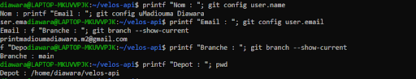
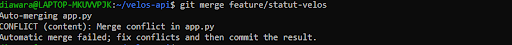
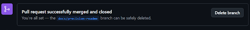
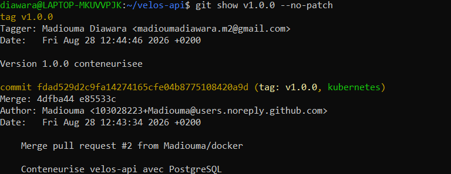
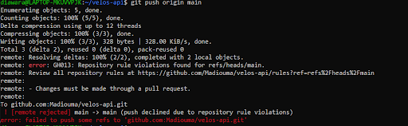

---

## 4. Jalon 2 · Docker

**Mesure du cache de construction**

| Situation | Durée mesurée |
| --- | --- |
| Construction avec les dépendances copiées après le code | 5,097 s |
| Construction avec les dépendances installées avant le code | 0,880 s |

Dans la version optimisée, les dépendances sont installées avant la copie de `app.py`. Une modification du code permet donc de réutiliser la couche contenant les dépendances grâce au cache Docker.

**Taille de l'image**

| Version | Taille |
| --- | --- |
| Version naïve, un seul étage | 209 MB |
| Version finale, plusieurs étages | 195 MB |

**Ce que le fichier d'exclusion de construction évite d'envoyer :** Le fichier `.dockerignore` exclut du contexte de construction les fichiers inutiles à l'image. Cela réduit la quantité de données envoyée au moteur Docker et évite d'intégrer inutilement certains fichiers au build.

**Comment j'ai prouvé la persistance :** J'ai modifié dans PostgreSQL la valeur `velos_disponibles` de `Gare Centrale` à `99`. Après `docker compose down`, j'ai vérifié que le volume était toujours présent, puis j'ai recréé les conteneurs. Une nouvelle requête SQL affichait toujours la valeur `99`, ce qui prouve que les données ont persisté malgré la suppression des conteneurs.

**Ce que je retiens :** Docker permet d'obtenir un environnement reproductible. L'ordre des instructions du Dockerfile améliore fortement l'utilisation du cache, le multi-stage réduit le contenu de l'image finale et les volumes permettent de conserver les données indépendamment des conteneurs.

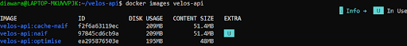
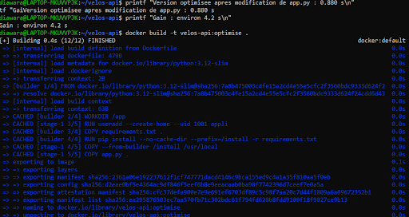
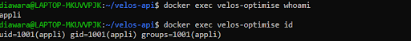
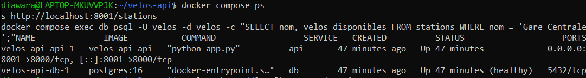
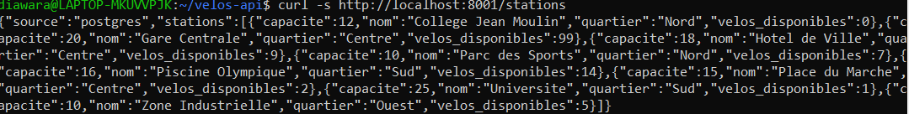
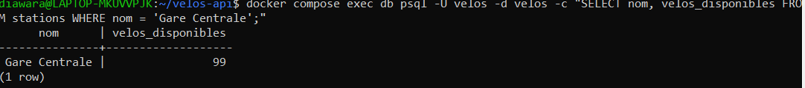

---
## 5. Jalon 3 · Kubernetes

**Comment j'ai obtenu le port 8081 vers le cluster :** L'API est exposée dans Kubernetes par un Service de type `NodePort` utilisant le port `30081`. Le cluster kind a été configuré avec un port mapping permettant d'accéder au service depuis la machine hôte via `localhost:8081`.

**Où vit le mot de passe, et pourquoi ce n'est pas un coffre-fort :** Les informations sensibles de connexion sont stockées dans un Secret Kubernetes nommé `velos-secret`. Les manifests utilisent `secretKeyRef` afin de ne pas écrire directement le mot de passe dans le code. Un Secret Kubernetes n'est cependant pas un véritable coffre-fort : les valeurs sont notamment encodées et leur protection dépend des droits d'accès au cluster.

**Ce que j'ai observé en supprimant un exemplaire sous trafic :** Lorsque j'ai supprimé un pod de l'API, les autres replicas ont continué à traiter les requêtes. Kubernetes a automatiquement créé un nouveau pod afin de revenir au nombre de replicas demandé. L'API est donc restée disponible pendant la panne d'un exemplaire.

**La mise à jour vers la version 2 :** J'ai publié l'image `madiouma/velos-api:2.0` contenant la nouvelle route `/alertes`, puis mis à jour le Deployment. Pendant le rolling update, j'ai envoyé 40 requêtes successives vers `/sante`. Les 40 requêtes ont répondu `HTTP 200`, donc aucune interruption n'a été observée côté client.

**Le retour arrière :** J'ai utilisé le mécanisme de rollback Kubernetes afin de revenir à la révision précédente du Deployment. L'historique des révisions était visible avec `kubectl rollout history deployment/velos-api`. Cela permet de rétablir rapidement une version précédente lorsqu'une nouvelle version pose problème.

**Ce que je retiens :** Kubernetes permet de maintenir automatiquement l'état désiré de l'application. Les replicas améliorent sa disponibilité, les probes contrôlent la santé des pods et les rolling updates permettent de déployer progressivement une nouvelle version avec possibilité de rollback.

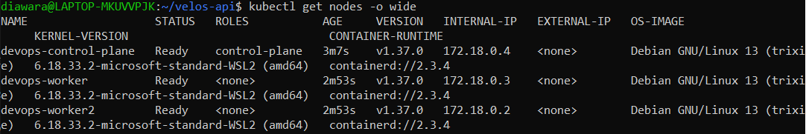
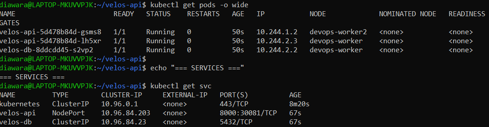
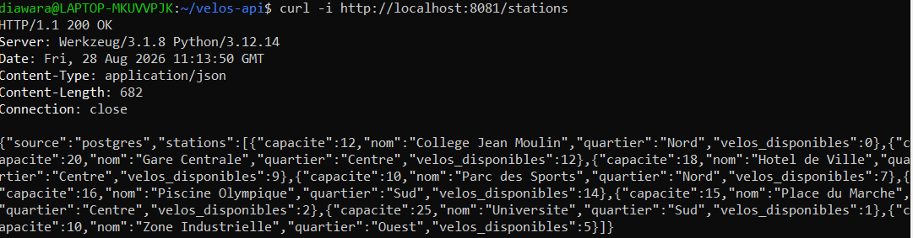
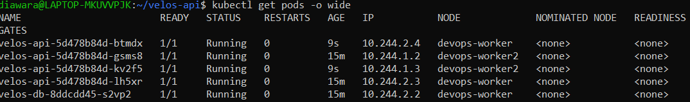
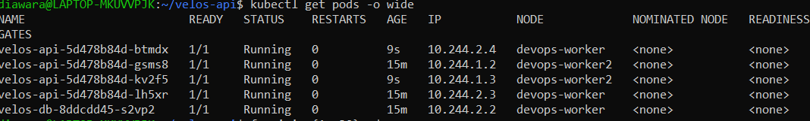
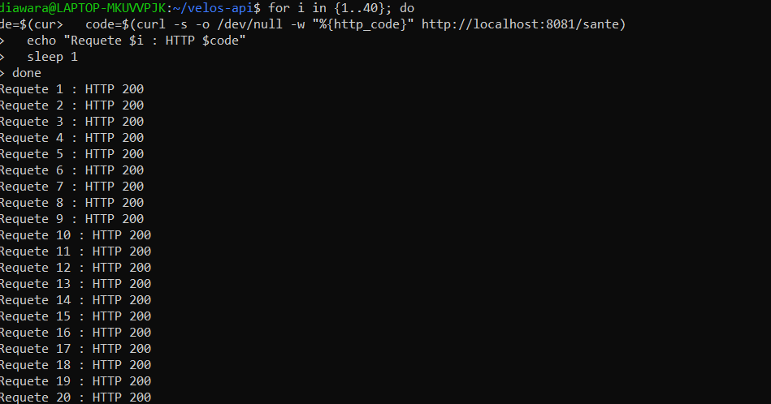
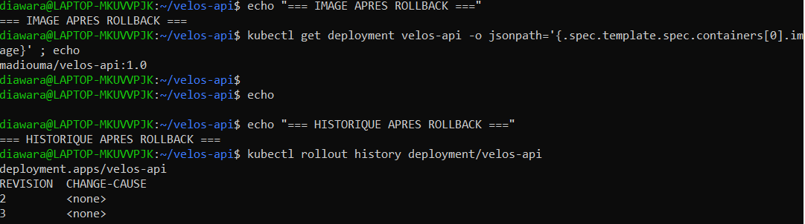

---
## 7. Mes trois difficultés

| # | Symptôme observé | Cause réelle | Correction apportée |
| --- | --- | --- | --- |
| 1 | `docker push` retournait `insufficient_scope: authorization failed` | L'authentification Docker Hub ne permettait pas la publication de l'image | Je me suis réauthentifié avec `docker login` et mon accès Docker Hub, puis le push de l'image a réussi |
| 2 | Le premier lancement Jenkins échouait avec `Host key verification failed` | Jenkins n'arrivait pas à récupérer correctement le dépôt GitHub avec la configuration Git utilisée | J'ai corrigé l'accès au dépôt pour permettre à Jenkins de récupérer le `Jenkinsfile`, puis le pipeline a pu démarrer |
| 3 | Le pipeline Jenkins est passé au rouge pendant le test d'échec | Le test `/alertes` avait volontairement été modifié pour attendre `HTTP 500` alors que l'API renvoyait `HTTP 200` | Jenkins a correctement bloqué les étapes suivantes. J'ai ensuite restauré le test à `200` dans une branche de correction et intégré celle-ci par Pull Request |

---

## 8. Ce qui n'est pas fait

Les objectifs principaux demandés ont été réalisés : utilisation de Git avec branches et Pull Requests, protection de `main`, conteneurisation Docker, persistance PostgreSQL, déploiement Kubernetes, réplication, test de panne, rolling update, rollback et pipeline CI/CD Jenkins.

Je n'ai pas mis en place de gestionnaire externe de secrets comme HashiCorp Vault. Les informations sensibles sont gérées avec les Secrets Kubernetes et les Credentials Jenkins, ce qui répond au besoin du projet mais pourrait être renforcé dans un environnement de production.

---

## 9. Assistance utilisée

J'ai utilisé ChatGPT comme assistant pendant la réalisation du projet.

L'assistance m'a servi principalement à :
- comprendre et diagnostiquer certaines erreurs Git, Docker, Kubernetes et Jenkins ;
- obtenir des explications sur les commandes utilisées ;
- proposer des commandes de diagnostic adaptées aux problèmes rencontrés ;
- m'accompagner dans la mise en place et le dépannage du pipeline Jenkins ;
- analyser les résultats obtenus avant de poursuivre les différentes étapes ;
- m'aider à structurer le rapport final.

J'ai exécuté moi-même les commandes dans mon environnement et vérifié leurs résultats avant de poursuivre.

J'ai également utilisé les interfaces et documentations des outils concernés, notamment GitHub, Docker Hub et Jenkins, lorsque cela était nécessaire.

---

## 10. Si j'avais deux jours de plus

Je renforcerais en priorité la sécurité et l'automatisation du projet.

J'ajouterais un véritable gestionnaire de secrets ainsi que des contrôles supplémentaires dans le pipeline, par exemple une analyse statique du code et un scan des vulnérabilités des images Docker.

J'ajouterais également davantage de tests automatisés, notamment des tests d'intégration avec PostgreSQL, ainsi qu'un système de supervision et de métriques pour surveiller l'application et le cluster.

Enfin, j'améliorerais la stratégie de versionnement et de déploiement afin de rapprocher davantage cette chaîne CI/CD d'un environnement de production.
